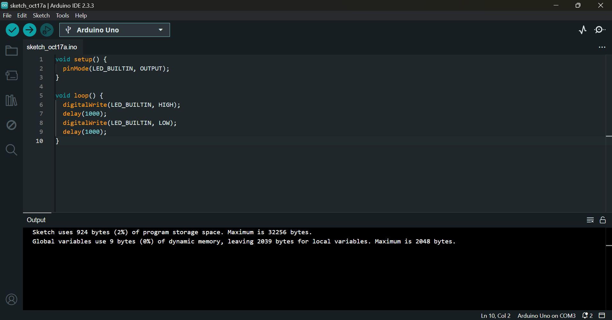
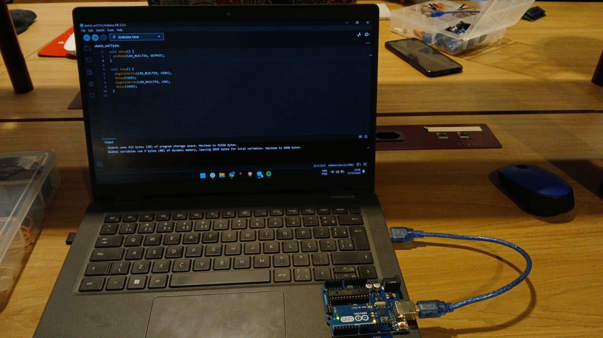
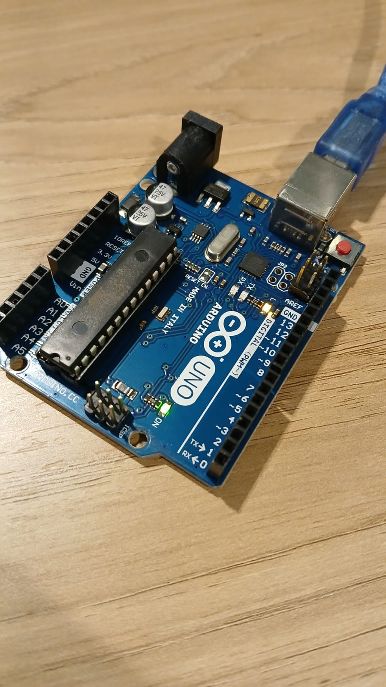
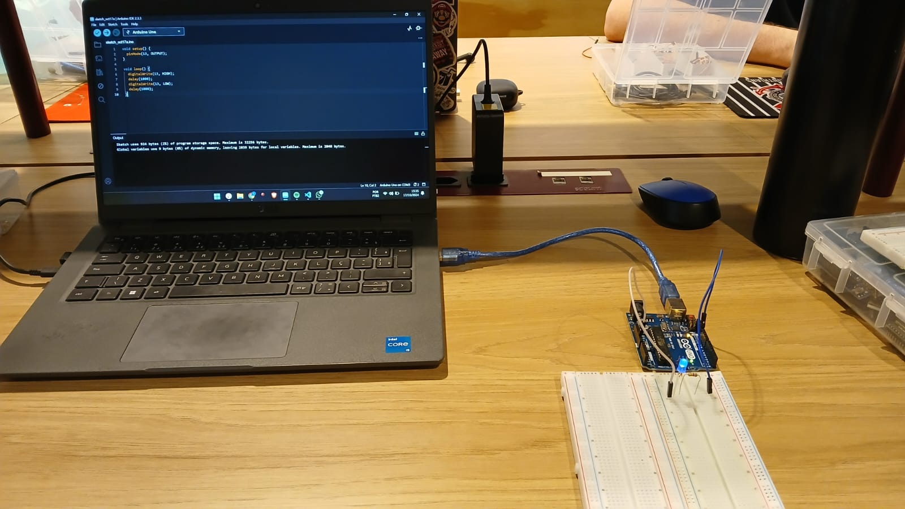
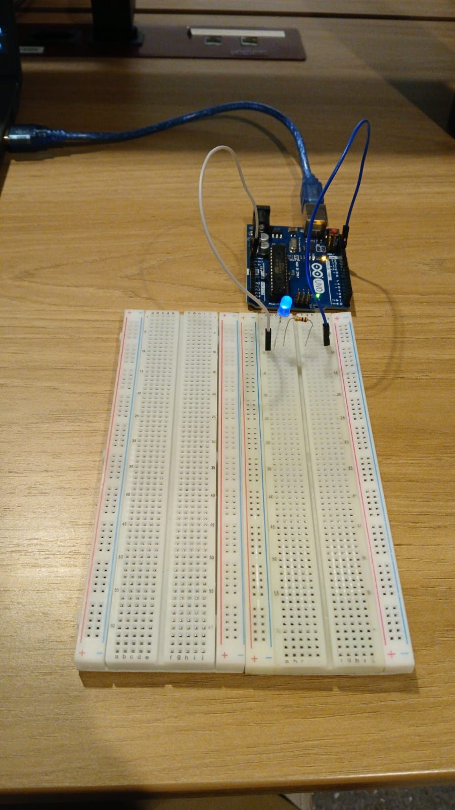

<h1>Blink com LED, circuitos físicos e no Tinkercad</h1>

<h2>Parte 1: Blink Led Interno</h2>

&emsp;&emsp;Após a realização dos autoestudos, com a orientação do roteiro fornecido, foi realizado o blink com o LED interno. 

&emsp;&emsp;Descrição: No blink realizado, o led ficará aceso por 1 segundo (1000 milissegundos); então, irá apagar e, após um 1 segundo desligado, voltará a acender; dessa forma, propon'do um loop que gera uma "luz piscando".

&emsp;&emsp;A seguir, estão dispostas as evidências dessa realização.

<div align="center">
<sup>Figura 1 - Arduino IDE</sup>

<sub>Fonte: Material produzido pelo autor(2024).</sub>
</div>

<br/>

<div align="center">
<sup>Figura 2 - Arduino ligado no computador</sup>

<sub>Fonte: Material produzido pelo autor(2024).</sub>
</div>

<br/>

<div align="center">
<sup>Figura 3 - LED embutido no arduino aceso</sup>

<sub>Fonte: Material produzido pelo autor(2024).</sub>
</div>

<br/>

&emsp;&emsp;Desse modo, está descrita a realização do blink do LED interno do arduino, acompanhado de evidências do código e do Arduino IDE, da conexão com o computador e do LED embutido no arduino aceso.

<h2>Parte 2: Simulando Blink Externo</h2>

&emsp;&emsp;Nessa parte 2, foi realizada uma simulação no TinkerCad com uma montagem do pisca-pisca com Arduino Uno. Ao clicar no play do TinkerCad, o projeto executa sem erros uma rotina que simula um pisca-pisca com cadência de 1 segundo.

Para acessar o link do projeto do Tinkercad (também disponível na Adalove), <a href="https://www.tinkercad.com/things/8u2uLTdh2OP/editel?sharecode=30fN1oElxX7dthzc5eG8stcP-R7pzdGQZI-f01Yiu5Y">clique aqui</a>.

<h3>Código do Tinkercad</h3>

Conforme solicitado, esse é o código executado na simulação no Tinkercad.

```
void setup() {
  pinMode(12, OUTPUT);
}

void loop() {
  digitalWrite(12, HIGH);
  delay(1000);
  digitalWrite(12, LOW);
  delay(1000);
}
```

Desse modo, foi realizada a simulação no circuito no Tinkercad.

<h2> Blink Externo na protoboard</h2>

&emsp;&emsp;Nessa seção, o circuito simulado no Tinkercad foi construído fisicamente com os respectivos componentes eletrônicos.<br/>
&emsp;&emsp;A seguir, segue-se as evidências no circuito funcionando conforme na simulação. <br/>
&emsp;&emsp;Observação: a fim de evitar redundância, o código executado não foi indicado, uma vez que foi utilizado o mesmo código do simulador, o qual já está descrito na seção acima.

<div align="center">
    <sup>Figura 4 - Circuito com LED OFF BOARD aceso conectado no computador</sup>
    
    <sub>Fonte: Material produzido pelo autor(2024).</sub>
</div>

<br/>

<div align="center">
    <sup>Figura 5 - Circuito com LED OFF BOARD aceso em foco</sup>
    
    <sub>Fonte: Material produzido pelo autor(2024).</sub>
</div>

<br/>

&emsp;&emsp;Desse modo, o circuito simulado construído com o Tinkercad foi reproduzido fisicamente com os componentes eletrônicos correspondentes.  